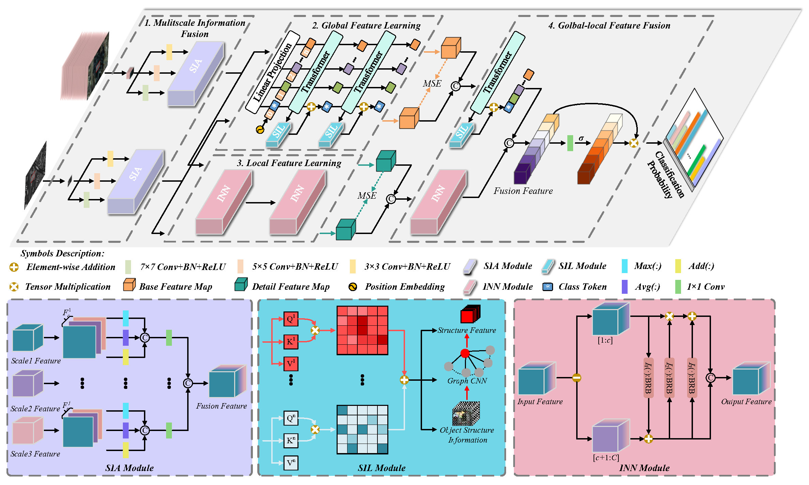

# NCGLF2 : Network combining global and local features for fusion of multisource remote sensing data 

Bing Tu, [Qi Ren](https://github.com/renqi1998/NCGLF2), Jun Li, Zhaolou Cao, Yunyun Chen, Antonio Plaza, "NCGLF2 : Network combining global and local features for fusion of multisource remote sensing data", Information Fusion, 2023

[[paper](https://pdf.sciencedirectassets.com/272144/1-s2.0-S1566253523X00128/1-s2.0-S1566253523005080/main.pdf)] 

🔥🔥🔥 News

> **Abstract:**  *The fusion of multisource remote sensing (RS) data has demonstrated significant potential in target recognition and classification tasks. However, there is limited emphasis on capturing both high- and low-frequency information from these data sources. Additionally, effectively integrating multisource data remains a challenging task, as the absence of redundancy and discriminant information hampers the applications of RS data. In this paper, we propose a fusion network called network combining global and local features (NCGLF2) that integrates global and local features (GLF) extracted from multisource RS data. This approach effectively leverages the capabilities of convolutional neural networks (CNNs) to extract high frequency features while utilizing transformer architecture to replicate low frequency information and remote correlations. Firstly, a scale information aggregation (SIA) module extracts multiscale shallow layer features from the input data sources. Secondly, a structural information learning transformer (SIL-Trans) module captures low frequency features, while an invertible neural network (INN) module learns high frequency information. Finally, a GLF fusion module maximizes the complementary characteristics of multisource RS data and GLF to effectively fuse high- and low-frequency information. Our experimental results with three benchmark datasets indicate that NCGLF2 outperforms existing state-of-the-art approaches in terms of feature representation and compatibility with diverse data types. The code is available at https://github.com/renqi1998/NCGLF2.*


**Fig. 1. HSI collected in 2013 over the city of Houston. (a) Real surface objects distribution. (b) Spectral signature of ‘‘Healthy grass" corresponding to pixel ①. (c) Spectral signature of ‘‘Healthy grass" corresponding to pixel ②. (d) Spectral signature of ‘‘Highway" corresponding to pixel ③. (e) Spectral signature of ‘‘Railway" corresponding to pixel ④.** 



**Fig. 2. Framework of the proposed method. SIA is the scale information aggregation module, SIL is defined as the structure information learning module, INN is the invertible neural network, and BRB is the bottleneck residual block.** 

## Dependencies

1. Python 3.8
2. PyTorch 
3. NVIDIA GPU + [CUDA](https://developer.nvidia.com/cuda-downloads)

```bash
# Clone the github repo and go to the default directory 'NCGLF2'.
git clone https://github.com/renqi1998/NCGLF2.git
conda create -n NCGLF2 python=3.8
conda activate NCGLF2
pip install -r requirements.txt
```

## Train

```python
python main.py
```

## Results

|    Dataset    |     OA      |     AA      |    Kappa    |
| :-----------: | :---------: | :---------: | :---------: |
| Houstion 2013 | 95.23(0.84) | 95.68(0.76) | 94.84(0.91) |
|   Augsbuyrg   | 95.68(0.32) | 84.94(1.45) | 93.80(0.45) |
| GRSS-DFC-2007 | 95.47(0.24) | 97.08(0.16) | 92.90(0.37) |

## Citation

If you find the code helpful in your research or work, please cite the following paper(s).

```bib
@article{tu2024ncglf2,
  title={NCGLF2: Network combining global and local features for fusion of multisource remote sensing data},
  author={Tu, Bing and Ren, Qi and Li, Jun and Cao, Zhaolou and Chen, Yunyun and Plaza, Antonio},
  journal={Information Fusion},
  volume={104},
  pages={102192},
  year={2024},
  publisher={Elsevier}
}
```

## Acknowledgements

This code is built on  [SIM-Trans]( https://github.com/PKU-ICST-MIPL/SIM-Trans_ACMMM2022 ).